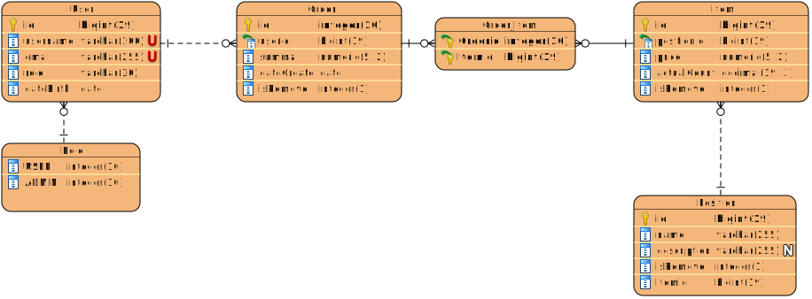

# Тестовое задание для Digital chief_

### 1. Описание предметной области




### 2. Git репозиторий

https://gitlab.com/OlgaGlavdel/

### 3. Технологии

БД PostgreSQL

Миграции liquibase

SwaggerApi  http://localhost:8086/openapi/swagger-ui/

Коллекция Postman [postman_collection](postman_collection)

Docker-compose


### 4. Run the app

For running application:

```bash
git clone https://gitlab.com/OlgaGlavdel/petkeeping.git
cd petkeeping

docker-compose -up
```

